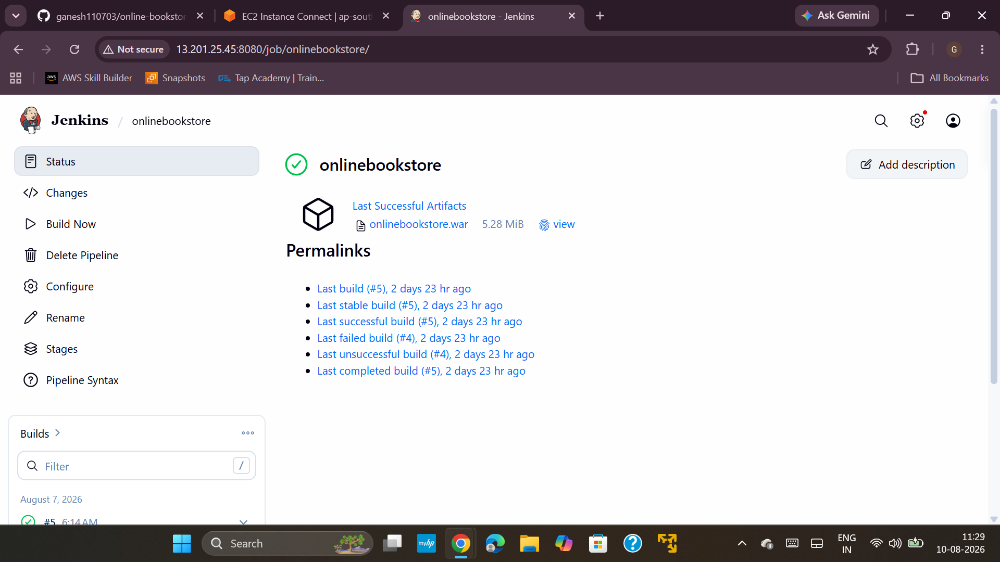
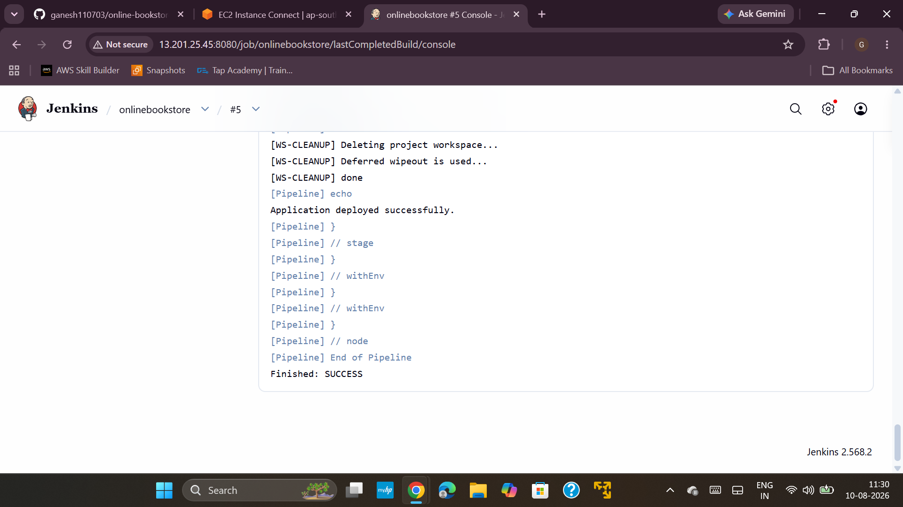
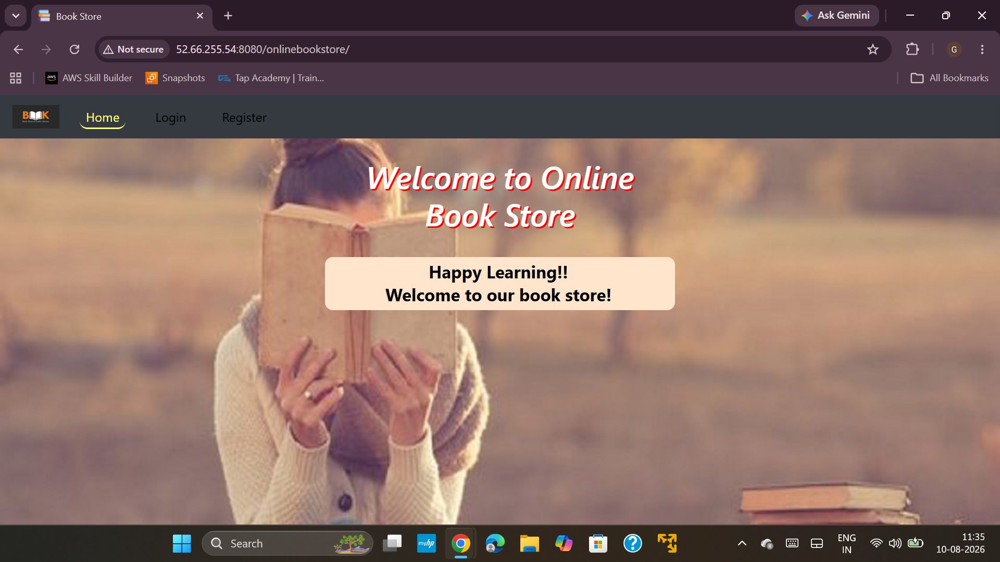

# 🚀 CI/CD Pipeline: GitHub → Jenkins → Maven → Tomcat → AWS EC2

> **Online Bookstore DevOps Project**
>
> A practical CI/CD deployment project demonstrating how a Java web application is built with Maven, automated through Jenkins, packaged as a WAR file, and deployed to Apache Tomcat running on AWS EC2.

---

## 📌 Pipeline Overview

```text
Developer / Git
       ↓
    GitHub
       ↓
    Jenkins
       ↓
  Maven Build
       ↓
onlinebookstore.war
       ↓
 Apache Tomcat
       ↓
   AWS EC2
       ↓
Online Bookstore
```

### Deployment Flow

1. Source code is maintained in GitHub.
2. Jenkins retrieves the project and runs the build.
3. Maven packages the application as `onlinebookstore.war`.
4. The WAR file is deployed to Apache Tomcat.
5. Tomcat runs the application on an AWS EC2 instance.
6. The deployed Online Bookstore is verified from a browser.

---

## 🛠️ Tools & Technologies

| Tool / Technology | Purpose |
|---|---|
| Git | Version control |
| GitHub | Source code repository |
| Jenkins | CI/CD automation |
| Apache Maven | Build and WAR packaging |
| Java | Application runtime/build |
| Apache Tomcat | Java web application server |
| Linux | Server administration |
| AWS EC2 | Cloud infrastructure |

---

# 📋 Task 1 — Git & GitHub Setup

## 1.1 GitHub Repository

Project repository:

```text
https://github.com/ganesh110703/online-bookstore-devops
```

The repository contains the application source, Jenkins configuration, Maven configuration, README documentation, and deployment screenshots.

## 1.2 Git Repository

The project was initialized and pushed to the GitHub repository.

Typical Git workflow:

```bash
git init
git add .
git commit -m "Add online bookstore DevOps project"
git branch -M main
git remote add origin <YOUR-REPOSITORY-URL>
git push -u origin main
```

## 1.3 Project Structure

```text
online-bookstore-devops/
├── src/
├── WebContent/
├── pom.xml
├── Jenkinsfile
├── README.md
├── jenkins-onlinebookstore.png
├── jenkins-onlinebookstore-console.png
└── onlinebookstore-tomcat.png
```

> **Note:** The application source is an existing Java web application. My contribution to this project is the DevOps implementation, CI/CD build, packaging, deployment, and AWS/Tomcat setup.

---

# 📋 Task 2 — Jenkins CI/CD Setup

## 2.1 Jenkins Job

The Jenkins job created for this application is:

```text
onlinebookstore
```

The successful build shown in the project is:

```text
Build #5
```

Jenkins successfully generated:

```text
onlinebookstore.war
```

### Jenkins Job Screenshot



---

## 2.2 Maven Build

Maven is used to build and package the Java web application.

The project uses Maven to generate a WAR artifact:

```text
onlinebookstore.war
```

The WAR file is the deployable application package used by Tomcat.

---

## 2.3 Jenkins Console Output

The Jenkins Console Output confirms that the deployment completed successfully.

Important result:

```text
Application deployed successfully.
Finished: SUCCESS
```

### Jenkins Console Screenshot



---

# 📋 Task 3 — Apache Tomcat Setup

Apache Tomcat is used as the application server for the Online Bookstore.

The Tomcat installation is located under:

```text
/opt/tomcat
```

The deployed application is placed under:

```text
/opt/tomcat/webapps/
```

The Tomcat `webapps` directory contains:

```text
onlinebookstore
onlinebookstore.war
```

This confirms that the WAR application has been deployed to Tomcat.

## 3.1 Tomcat Application URL

The application is accessed through Tomcat on port `8080`.

Example:

```text
http://<TOMCAT-EC2-PUBLIC-IP>:8080/onlinebookstore/
```

---

# 📋 Task 4 — AWS EC2 Deployment

The project uses AWS EC2 instances for the DevOps environment.

### Jenkins Server

Jenkins is hosted on an AWS EC2 instance and is responsible for the CI/CD process.

### Tomcat Server

Apache Tomcat is hosted on an AWS EC2 instance and runs the deployed Online Bookstore application.

### Application Port

Tomcat uses:

```text
8080
```

The application is accessed through:

```text
http://<EC2-PUBLIC-IP>:8080/onlinebookstore/
```

---

# 📋 Task 5 — End-to-End CI/CD Verification

The complete deployment flow is:

```text
GitHub
   ↓
Jenkins
   ↓
Maven
   ↓
WAR File
   ↓
Apache Tomcat
   ↓
AWS EC2
   ↓
Online Bookstore
```

## 5.1 Jenkins Verification

Jenkins build:

```text
onlinebookstore #5
```

Result:

```text
SUCCESS
```

Artifact:

```text
onlinebookstore.war
```

## 5.2 Tomcat Verification

The deployed application is present in:

```text
/opt/tomcat/webapps/
```

with:

```text
onlinebookstore
onlinebookstore.war
```

## 5.3 Browser Verification

The Online Bookstore application was successfully opened through the Tomcat server.

### Online Bookstore Running on Tomcat



---

# 📸 Project Screenshots

## Jenkins Job

Shows the `onlinebookstore` Jenkins job and successful build/WAR artifact.


## Jenkins Console Output

Shows the successful deployment pipeline execution.


## Online Bookstore Application

Shows the Online Bookstore application running through Apache Tomcat.


---

# 🔧 Troubleshooting & Verification

| Issue / Check | Verification |
|---|---|
| Jenkins job | `onlinebookstore` |
| Jenkins build | Build #5 successful |
| WAR artifact | `onlinebookstore.war` |
| Jenkins deployment result | `Finished: SUCCESS` |
| Tomcat deployment directory | `/opt/tomcat/webapps/` |
| Deployed application | `onlinebookstore` |
| Tomcat port | `8080` |
| Application | Online Bookstore |

---

# 📦 Project Deliverables

- [x] GitHub repository
- [x] Jenkins CI/CD job
- [x] Maven build
- [x] WAR artifact generation
- [x] Apache Tomcat deployment
- [x] AWS EC2 hosting
- [x] Jenkins successful-build screenshot
- [x] Jenkins Console Output screenshot
- [x] Tomcat application screenshot
- [x] README documentation

---

# 🎯 Key DevOps Skills Demonstrated

- Git & GitHub
- Jenkins CI/CD
- Maven
- WAR packaging
- Apache Tomcat
- Linux
- AWS EC2
- Application deployment
- CI/CD troubleshooting
- Deployment verification

---

# 👨‍💻 Author

**Ganesh**

Cloud / DevOps Engineering Fresher

GitHub:

```text
https://github.com/ganesh110703
```

Project:

```text
https://github.com/ganesh110703/online-bookstore-devops
```

---

> **Project note:** The application source is an existing Java web application. This repository documents my hands-on DevOps implementation around the application, including GitHub, Jenkins, Maven, WAR packaging, Apache Tomcat, AWS EC2 deployment, and verification.
